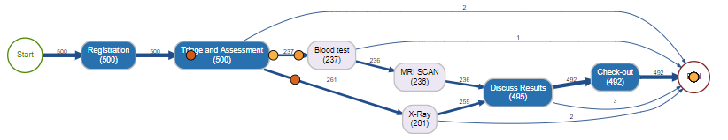

# processanimateR

> Flexible token replay animation for process maps

[](https://cran.r-project.org/package=processanimateR)
[](https://www.tidyverse.org/lifecycle/#experimental)
[](https://travis-ci.org/fmannhardt/processanimateR)

[](https://fmannhardt.github.io/processanimateR/index.html)

Flexible token replay animation for process maps created through the [processmapR](https://github.com/gertjanssenswillen/processmapR/) package from the [bupaR](http://www.bupar.net) suite, which uses [DiagrammeR](https://github.com/rich-iannone/DiagrammeR/) and [viz.js](https://github.com/mdaines/viz.js) library to render process maps using GraphViz. 
ProcessanimateR adds a [htmlwidget](https://www.htmlwidgets.org/) that uses SVG animations ([SMIL](https://www.w3.org/standards/techs/smil#w3c_all)) to create the animation. 
Sizes, colors, and the image used for tokens are customizable based on trace, event attributes, or a secondary data frame if an attribute does not change according to the original event log.

## Getting Started

### Installing

ProcessanimateR is not yet available on CRAN. Please use the remotes package or similar means to install it directly from source.

```r
# install the remotes package
source("https://install-github.me/r-lib/remotes")

# use remotes to install the latest version of processanimateR
remotes::install_github("fmannhardt/processanimateR")

# or install a specific tag
remotes::install_github("fmannhardt/processanimateR@v0.1.0")
```

### Warnings and Limitations
* Tokens travel through the process approximately according to the times at which (start and complete) events of the activities occur. In some cases processanimateR will add a small epsilon time to make sure that the SMIL animation works fine, since there seem to be some limitations with regard to zero duration animations. 
* Be aware that the perceived speed in which tokens travel depends on the length of edges in the process map, which is the result of an automatic layout algorithm and does not represent any kind of real distance between activities. 
* Parallelism is still handled poorly as to be expected from a process map. In particular overlapping start and completion times of activities may result in tokens moving unexpectedly.

### Usage

There are two main functions: `animate_process` and `ianimate_process` (interactive version).

We use the `patients` event log provided by the `eventdataR` package. 
```r
library(processanimateR)
library(eventdataR)
data(patients)
```

A basic animation with static color and token size:
```r
animate_process(patients)
```

Default token color, size, or image can be changed as follows:
```r
animate_process(patients, token_size = 2)
animate_process(patients, token_color = "red")
animate_process(patients, token_image = "https://upload.wikimedia.org/wikipedia/en/5/5f/Pacman.gif", token_size = 15)
```

Dynamic token colors or sizes based on event attributes can be configured:
```r
animate_process(add_token_color(patients, "time", "color"), token_color = "color")
animate_process(add_token_color(patients, "employee", "color", 
                color_mapping = scales::col_factor("Paired", patients$employee)),
                token_color = "color")
```

It is also possible to use a secondary data frame to color the tokens irregardless of the event times. This can be useful if measurement are taken throughout a process, but the measurement event itself should not be included in the process map. For example, the lactic acid measurements of the `sepsis` data could be used in that way: 
```r
library(dplyr)
data(sepsis)

# Extract only the lacticacid measurements
lactic <- sepsis %>%
    mutate(lacticacid = as.numeric(lacticacid)) %>%
    filter_activity(c("LacticAcid")) %>%
    as.data.frame() %>%
    select("case" = case_id, "time" =  timestamp, lacticacid)

# Create a numeric color scale
cscale <- scales::col_numeric("Oranges", lactic$lacticacid , na.color = "white")

# Create colors data frame for animate_process
lacticColors <- lactic %>%
    mutate(color = cscale(lacticacid))

# Remove the measurement events from the sepsis log
sepsisBase <- sepsis %>%
    filter_activity(c("LacticAcid", "CRP", "Leucocytes", "Return ER",
                      "IV Liquid", "IV Antibiotics"), reverse = T) %>%
    filter_trace_frequency(percentage = 0.95)
animate_process(sepsisBase, token_color = lacticColors, animation_mode = "relative",
                animation_duration = 600)
```


There is also an interactive variant that starts a Shiny web-application. It expects that attributes are of an appropriate data type to choose a good color scale.
```r
library(edeaR)
library(dplyr)
ianimate_process(sepsis %>%
 filter_trace_frequency(percentage = 0.3) %>%
 # we fix the datatype of some of the attributes to allow proper rendering of the token color
 # the token size option currently only support numeric attributes
 mutate_at(c("lacticacid", "leucocytes", "crp", "age"), as.numeric) %>%
 mutate_at(c("disfuncorg", "sirscriteria2ormore", "infectionsuspected"), as.logical))
```

## Libraries Used
This package makes use of the following libraries:
* [d3](https://d3js.org), to dynamically changing the SVG;
* [fakesmil](https://github.com/FakeSmile/FakeSmile), to provide SMIL support in most browsers;
* [svg-pan-zoom](https://github.com/ariutta/svg-pan-zoom), for the panning/zooming option;
* [viz](https://github.com/mdaines/viz.js/), to compile the DOT generated by processmapR in JavaScript;
* [bupaR](https://github.com/gertjanssenswillen/bupaR), for the base Process Mining functions in R.

## Versioning

We use [SemVer](http://semver.org/) for versioning. For the versions available, see the [tags on this repository](https://github.com/fmannhardt/processanimateR/tags). 

## Authors
Felix Mannhardt ([SINTEF Læring og beslutningsstøtte](https://www.sintef.no/sintef-teknologi-og-samfunn/arbeid_naringsliv/laring-og-beslutningsstotte/))

## License

This software is licensed under the MIT License - see the [LICENSE](LICENSE) file for details

## Acknowledgments

This software was developed in the [HUMAN project](http://www.humanmanufacturing.eu/), which has received funding from the European Union’s Horizon 2020 research and innovation programme under grant agreement no. 723737 (HUMAN)
