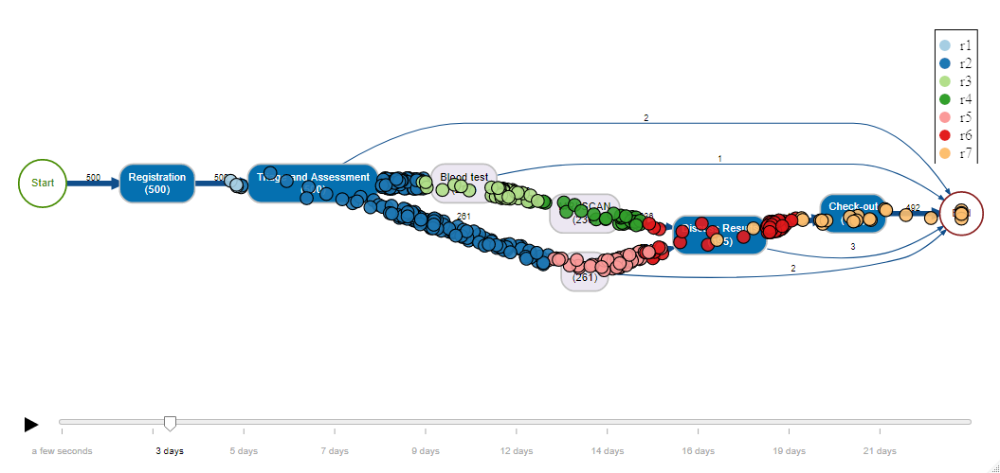

# processanimateR

> Flexible token replay animation for process maps created by bupaR using SVG animations.

[](https://cran.r-project.org/package=processanimateR)
[](https://cran.r-project.org/package=processanimateR)
[](https://www.tidyverse.org/lifecycle/#maturing)
[](https://travis-ci.org/bupaverse/processanimateR)

[](https://bupaverse.github.io/processanimateR/example/processanimateR-banner.html)

Flexible token replay animation for process maps created through the [processmapR](https://github.com/gertjanssenswillen/processmapR/) package from the [bupaR](http://www.bupar.net) suite, which uses [DiagrammeR](https://github.com/rich-iannone/DiagrammeR/) and [viz.js](https://github.com/mdaines/viz.js) library to render process maps using GraphViz. As alternative renderer [Leaflet](https://leafletjs.com/) with fixed coordinates for activities is also supported.

ProcessanimateR provides a [htmlwidget](https://www.htmlwidgets.org/) using SVG animations ([SMIL](https://www.w3.org/standards/techs/smil#w3c_all)) to create the animation. Sizes, colors, and many more aspects of the token shapes are customizable based on trace, event attributes, or a secondary data frame if an attribute does not change according to the original event log.

## Getting Started

**WARNING: There are breaking changes in the API of this package between v0.3.0 and v1.0.0**

### Installing

A stable version of ProcessanimateR can be installed from CRAN:
```r
install.packages("processanimateR")
```

You can also use the development or specific released version by using the remotes package. 
Note that the current development version may break without warning. 
```r
# install the remotes package
source("https://install-github.me/r-lib/remotes")

# use remotes to install the latest version of processanimateR
remotes::install_github("bupaverse/processanimateR")

# or install a specific tag
remotes::install_github("bupaverse/processanimateR@v0.3.0")
```

### Warnings and Limitations
* Tokens travel through the process approximately according to the times at which (start and complete) events of the activities occur. In some cases processanimateR will add a small epsilon time to make sure that the SMIL animation works fine, since there seem to be some limitations with regard to zero duration animations. 
* Be aware that the perceived speed in which tokens travel depends on the length of edges in the process map, which is the result of an automatic layout algorithm and does not represent any kind of real distance between activities. 
* Parallelism is still handled poorly as to be expected from a process map. In particular overlapping start and completion times of activities may result in tokens moving unexpectedly.
* The timeline slider option cannot be used in Internet Explorer due to missing support for certain SVG animation functions.

### Usage

We use the `patients` event log provided by the `eventdataR` package. 
```r
library(processanimateR)
library(eventdataR)
```

A basic animation with static color and token size:
```r
animate_process(patients)
```

Default token color, size, or image can be changed as follows:
```r
animate_process(example_log, mapping = token_aes(size = token_scale(12), shape = "rect"))
animate_process(example_log, mapping = token_aes(color = token_scale("red")))
```

The example animation on the top of this site:
```r
animate_process(patients, mode = "relative", jitter = 10, legend = "color",
  mapping = token_aes(color = token_scale("employee", 
    scale = "ordinal", 
    range = RColorBrewer::brewer.pal(7, "Paired"))))
```

Tokens can also be assigned images, for example:
```r
animate_process(example_log,
   mapping = token_aes(shape = "image",
    size = token_scale(10),
    image = token_scale("https://upload.wikimedia.org/wikipedia/en/5/5f/Pacman.gif")))
```

More advanced usage examples can be found [here](https://bupaverse.github.io/processanimateR/articles/).

## Libraries Used
This package makes use of the following libraries:

* [bupaR](https://github.com/gertjanssenswillen/bupaR), for the base process mining functions in R.
* [viz.js](https://github.com/mdaines/viz.js), for the GraphViz layout;
* [d3](https://d3js.org), for SVG management;
* [d3-legend](https://github.com/susielu/d3-legend), to render D3 scales;
* [fakesmil](https://github.com/FakeSmile/FakeSmile), to provide SMIL support in most browsers;
* [svg-pan-zoom](https://github.com/ariutta/svg-pan-zoom), for the panning/zooming option;
* [MomentJS](https://github.com/moment/moment), for parsing and formatting times and durations;
* [Leaflet](https://leafletjs.com/), for rendering process maps on geographical maps.

## Versioning

We use [SemVer](http://semver.org/) for versioning. For the versions available, see the [tags on this repository](https://github.com/bupaverse/processanimateR/tags). 

## Authors
Felix Mannhardt ([SINTEF Digital -- Technology Management Department](https://www.sintef.no/digital/))

## License

This software is licensed under the MIT License - see the [LICENSE](https://github.com/bupaverse/processanimateR/blob/master/LICENSE.md) file for details.

## Acknowledgments

This software was partly supported by the [HUMAN project](http://www.humanmanufacturing.eu/), which has received funding from the European Union's Horizon 2020 research and innovation programme under grant agreement no. 723737 (HUMAN)
